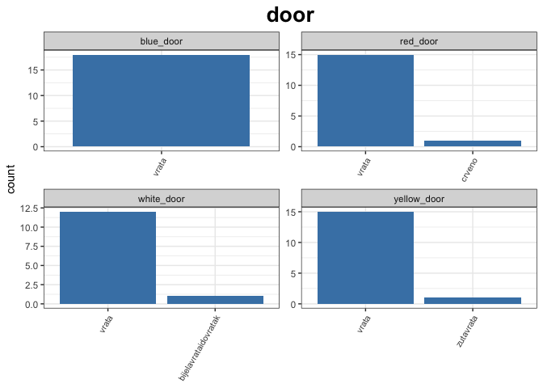
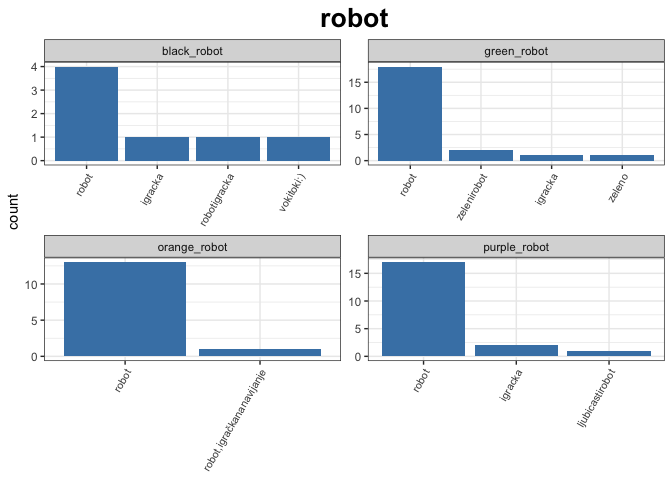
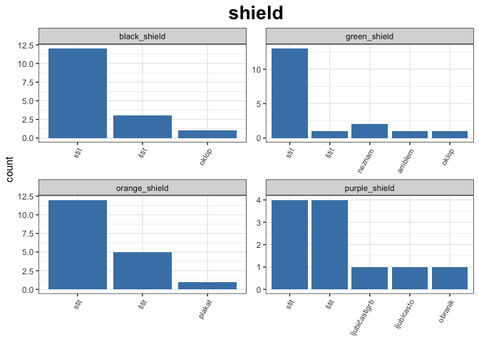

Perceptual Difficulty - Norming for Namability
================

# Participant Demographics

## Language status

This has yet to be cleaned up: people classified as "heritage" and "foreign" may actually be native of SIMK speakers.

Foreign: first language and language spoken at school are not BCS
Heritage: first language is BCS and language spoken at school is not BCS
SIMK: Country of origin is Slovenia (SI) or Macedonia (MK)
native: first language and language spoken at school are BCS

## Dialect Information

### Dialect Measure 1

Dialects are often split up based on the phonological change of the Common Slavic *jat* vowel (\*ě), which changed to /i/ (Ikavian/Ikavica), /e/ (Ekavian/Ekavica), or /ije/ /je/ (Ijekavian/Ijekavica). Standard Croatian and Bosnian is based on Ijekavian, whereas standard Serbian is based on Ekavian. Serbians in Croatia, Bosnian Serbs, and Montenegrians mainly use Ijekavian. A geographic distribution is shown below.

yellow: ijekaciva
blue: ekavica
red: ikavica

Our participants had the following distribution:

### Dialect Measure 2

Another common way of classifying the dialects is based on their most common wuestion word for "what":

Shtokavian (Štokavski) = što/šta
Chakavian (Čakavski) = Ča/ca
Kajkavian (Kajkavski) = Kaj/key

Shtokavian is the standard for all of BCS and is spoken in Bosnia and Herzegovina, Croatia, Montenegro, and Serbia. Chakavian is spoken on the Croatian coast and Kajkavian is spoken in northern Croatia. Slovenians use the word "kaj" for the "what" question word, therefore I assume Slovenians would be classified as Kaikavian speakers based on my dialect survey (even if they don't produce the word "kaj" when speaking BCS).

The map below gives a geographic distribution of the three dialects in Croatia. Bosnia and Herzegovina, Mongenegro, and Serbia would all be colored green based on this map.

Chakavian (blue) = Čakavski
Kaikavian (purple) = Kajkavski
Shtokavian (green) = Štokavski

Our participants had the following dialect distribution:

### Country of participants

Participants answered the question: In which Ex-Jugoslav country did I live in/spent a lot of time in. This question aims to get a geographic distribution of participants. While we can classify speakers across ekavian/ikavian/ijekavian dialects, since this distiction represents a phonological one, it is unclear whether it will likewise reflect a difference in use of lexical items. Keep in mind that the answer to this question is distinct from what nationality participants identify as (for example there are Serbians, Croatians, and Bosnians who all live in Bosnia and Hercegovina). Based on my (limited) observations, I believe that country may be a better predictor of lexical items than national identity could be.

BIH: Bosnia and Herzegovina
HR: Croatia
SRB: Serbia
SI: Slovenia
MK: Macedonia
MNE: Montenegro

# Participant Responses

Responses that participants gave to the question "What is this object called?" are given below. Each graph is faceted based on the color the object was presented in.

There are several things that need to be cleaned up in these graphs but please keep the following things in mind: 1. Some participants could not answer with 3 letter words. Therefore, if one of the top answers was a three letter word, take the rest of the answers with a grain of salt 2. Some participants used the diacritics š, č, ć, ž, or đ, whereas others did not. This may make the answers seem less consistent than they actually are. 3. Different spellings of the same word or a word with spelling errors are categorized as different answers

The answers will be classified in the following ways: 1. Consistent labelling
2. Dialect consistent labelling with one gender
3. Dialect consistent labelling with two or more genders
4. Inconsistent labelling

I am currently working on:
- getting rid of diacritics all across the board - classifying the answers according to the four cateogries listed above

    ## [[1]]

    ## 
    ## [[2]]

    ## 
    ## [[3]]

    ## 
    ## [[4]]

    ## 
    ## [[5]]

    ## 
    ## [[6]]

    ## 
    ## [[7]]

    ## 
    ## [[8]]

    ## 
    ## [[9]]

    ## 
    ## [[10]]

    ## 
    ## [[11]]

    ## 
    ## [[12]]

    ## 
    ## [[13]]

    ## 
    ## [[14]]

    ## 
    ## [[15]]

    ## 
    ## [[16]]

    ## 
    ## [[17]]

    ## 
    ## [[18]]

    ## 
    ## [[19]]

    ## 
    ## [[20]]

    ## 
    ## [[21]]

    ## 
    ## [[22]]

    ## 
    ## [[23]]

    ## 
    ## [[24]]

    ## 
    ## [[25]]

    ## 
    ## [[26]]

    ## 
    ## [[27]]

    ## 
    ## [[28]]

    ## 
    ## [[29]]

    ## 
    ## [[30]]

    ## 
    ## [[31]]

    ## 
    ## [[32]]

    ## 
    ## [[33]]

    ## 
    ## [[34]]

    ## 
    ## [[35]]

    ## 
    ## [[36]]

    ## 
    ## [[37]]

    ## 
    ## [[38]]

    ## 
    ## [[39]]

    ## 
    ## [[40]]

    ## 
    ## [[41]]

    ## 
    ## [[42]]

    ## 
    ## [[43]]

    ## 
    ## [[44]]

    ## 
    ## [[45]]

    ## 
    ## [[46]]

    ## 
    ## [[47]]

    ## 
    ## [[48]]

    ## 
    ## [[49]]

    ## 
    ## [[50]]

    ## 
    ## [[51]]

    ## 
    ## [[52]]

    ## 
    ## [[53]]

    ## 
    ## [[54]]

    ## 
    ## [[55]]

    ## 
    ## [[56]]

    ## 
    ## [[57]]

    ## 
    ## [[58]]

    ## 
    ## [[59]]

    ## 
    ## [[60]]

    ## 
    ## [[61]]

    ## 
    ## [[62]]

    ## 
    ## [[63]]

    ## 
    ## [[64]]

    ## 
    ## [[65]]

    ## 
    ## [[66]]

    ## 
    ## [[67]]

    ## 
    ## [[68]]

    ## 
    ## [[69]]

    ## 
    ## [[70]]

    ## 
    ## [[71]]

    ## 
    ## [[72]]

    ## 
    ## [[73]]

    ## 
    ## [[74]]

    ## 
    ## [[75]]

    ## 
    ## [[76]]

    ## 
    ## [[77]]

    ## 
    ## [[78]]

    ## 
    ## [[79]]

    ## 
    ## [[80]]

    ## 
    ## [[81]]

    ## 
    ## [[82]]

    ## 
    ## [[83]]

    ## 
    ## [[84]]

    ## 
    ## [[85]]

    ## 
    ## [[86]]

    ## 
    ## [[87]]

    ## 
    ## [[88]]

    ## 
    ## [[89]]

    ## 
    ## [[90]]

    ## 
    ## [[91]]

    ## 
    ## [[92]]

    ## 
    ## [[93]]

    ## 
    ## [[94]]

    ## 
    ## [[95]]

    ## 
    ## [[96]]

    ## 
    ## [[97]]

    ## 
    ## [[98]]

    ## 
    ## [[99]]

    ## 
    ## [[100]]

    ## 
    ## [[101]]

    ## 
    ## [[102]]

    ## 
    ## [[103]]

    ## 
    ## [[104]]

    ## 
    ## [[105]]

